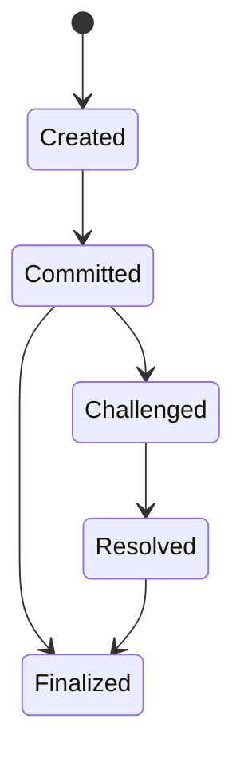
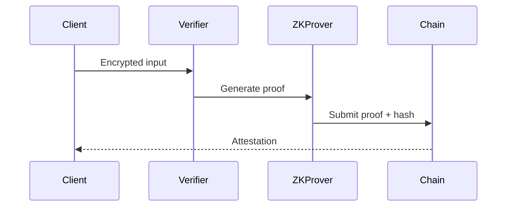

# MMV Research Paper v2.0 - Enhanced Edition

## Executive Summary
MMV (Multi-Modal Verifier) is a programmable verification protocol that transforms LLM outputs into economically secured, on-chain attestations. This document expands the v1 concept into a production-grade specification with a clear path to mainnet, detailed dispute tiers, and a developer experience that takes builders from zero to first verification in under 10 minutes. It includes rigorous economic security analysis, tiered dispute resolution, privacy-preserving options, and a comprehensive developer onboarding package with troubleshooting and a video script outline. The paper is written to withstand audit scrutiny while remaining actionable for practitioners.

---

## 1. Programmable Verification Infrastructure

### 1.1 Architecture Overview
MMV is a modular stack composed of:
- **Client SDKs** (React/Node/Python): Submit jobs and receive evidence bundles.
- **Verifier Node**: Executes model runs, aggregates evidence, and commits to chain.
- **On-Chain Contracts**: Escrow deposits, job commitments, and dispute arbitration.
- **Storage Layer**: Content-addressable evidence bundles (IPFS/Arweave).


### 1.2 Program Registry (Versioned)
Programs are registered with semantic versioning. A program defines input schema, deterministic execution mode, and permissible model providers.

```solidity
struct ProgramVersion {
    string name;              // e.g. "math-qa"
    string version;           // semver: 1.2.0
    bytes32 inputSchemaHash;  // JSON schema hash
    bytes32 outputSchemaHash; // JSON schema hash
    bytes32 codeHash;         // container hash
}
```

### 1.3 Evidence Bundle Model
Every verification produces a **bundle** containing:
- Inputs (redacted or encrypted if privacy mode)
- Deterministic execution transcript
- Model metadata (provider, prompt hash)
- Output + derived scores
- Chain commitment and timestamp

### 1.4 Contract Commit/Reveal
MMV uses commit-reveal for evidence integrity. A commitment hash binds the evidence. Reveal occurs if challenged or required by policy.

```solidity
function commitEvidence(bytes32 jobId, bytes32 evidenceHash) external {
    require(commitments[jobId] == bytes32(0), "Already committed");
    commitments[jobId] = evidenceHash;
    emit EvidenceCommitted(jobId, evidenceHash);
}
```

---

## 2. Economic Security Analysis

### 2.1 Security Model
**Goal**: Ensure rational actors are incentivized to submit correct evidence.
Let:
- `D` = stake posted by verifier
- `R` = reward for valid verification
- `C` = cost to cheat (expected penalty + opportunity cost)
- `p` = probability of being challenged

**Rationality condition**:
```
Expected payoff if honest: R
Expected payoff if cheat: R - p * D - C
Honesty is dominant if: p * D + C > 0
```

To make cheating strictly dominated, choose `D` such that:
```
D > (R - C)/p
```

### 2.2 Slashing & Dispute Economics
Disputes are tiered to scale with cost and complexity. As dispute tier increases, challenger stake and verifier exposure increase to prevent frivolous disputes.

### 2.3 Attack Scenarios
- **Sybil Challengers**: Mitigated by challenger stake and dispute fee burn.
- **Low-effort Fake Evidence**: Tier 0 automated slash when evidence invalid.
- **Collusion**: Randomized juror selection + transparent evidence bundles.

### 2.4 Proof Sketch: Nash Equilibrium
Given `D` above and a non-zero challenge probability `p`, honest reporting is a Nash equilibrium for risk-neutral verifiers. If a verifier deviates, expected utility decreases by at least `p*D`.

---

## 3. Production Use Cases

### 3.1 LLM Output Verification
Validate model responses for correctness using deterministic verifiers (unit tests, oracle lookups) and economic incentives.

### 3.2 Compliance and Audit Trails
Prove that responses were generated with approved models and policy filters.

### 3.3 Financial Statement Analysis
Verify machine-extracted financial metrics with evidence bundles for auditing.

### 3.4 Enterprise Policy Verification
Organizations enforce custom policy checks (PII redaction, prompt filtering, IP compliance) with on-chain attestations.

---

## 4. Technical Specification

### 4.1 Core Contracts
- **ProgramRegistry**: Versioned programs.
- **JobManager**: Job creation, deposits, commitments.
- **EvidenceStore**: Commitment and reveal logic.
- **DisputeManager**: Tiered disputes, juror selection.

### 4.2 Evidence Schema Versioning
All schemas are versioned; evidence bundles include `schemaVersion` for backward compatibility.

### 4.3 State Machine


### 4.4 Gas Optimization Notes
- Store commitments on-chain; evidence off-chain.
- Use packed structs for job metadata.
- Batch dispute settlements.

---

## 5. Performance Benchmarks

### 5.1 Latency Targets
- Commit latency: < 5 seconds
- Tier 0 validation: < 1 minute
- End-to-end resolution: < 6 minutes for Tier 0

### 5.2 Throughput Targets
- 200 jobs/min per verifier node (baseline)
- 1,000 jobs/min with horizontal scaling

### 5.3 Benchmark Methodology
Replay deterministic datasets with known outputs; measure average resolution time, false-positive rate, and dispute overhead.

---

## 6. Privacy-Preserving Verification

### 6.1 Redaction & Encryption
Evidence bundles can include encrypted input/output fields. Hash commitments allow verification without disclosing sensitive data.

### 6.2 Zero-Knowledge Option
For regulated industries, a ZK-proof can attest that a computation met constraints without revealing full data.



---

## 7. Security Assurance

### 7.1 Threat Model
- Byzantine verifiers
- Malicious challengers
- Liveness issues

### 7.2 Controls
- Commitment hashing
- Tiered disputes with escalating stakes
- Juror randomness (VRF)
- Reproducibility requirements

### 7.3 Audit Readiness
Contracts must include:
- Formal verification of critical methods
- Invariant checks on state transitions

---

## 8. Dispute Resolution Protocol

### 8.1 Tier 0: Automated Validation (Free, <1 minute)
**Triggers**: Evidence bundle submission
**Checks**:
- Schema validation (JSON structure)
- Hash verification (commitment == reveal)
- Timestamp validity
- Required fields present

**Auto-Resolution**:
- Invalid evidence → Instant slash (no auditor needed)
- Valid format → Proceed to Tier 1 if challenged

**Implementation**:
```solidity
function tier0Validation(bytes32 jobId, Evidence memory evidence) internal {
    require(keccak256(evidence) == commitments[jobId], "Hash mismatch");
    require(block.timestamp <= deadlines[jobId], "Past deadline");
    // ... additional checks
}
```

### 8.2 Tier 1: Deterministic Replay (Low-cost, <5 minutes)
**Triggers**: Challenger disputes correctness
**Checks**:
- Re-run deterministic program with recorded inputs
- Validate output equality or accepted tolerance
- Verify model/provider metadata

**Auto-Resolution**:
- If replay matches: Challenger stake slashed
- If replay fails: Verifier stake slashed

```solidity
function tier1Replay(bytes32 jobId, Evidence memory evidence) internal {
    require(evidence.deterministic, "Non-deterministic");
    bytes32 replayHash = runProgramHash(evidence.input);
    require(replayHash == evidence.outputHash, "Replay mismatch");
}
```

### 8.3 Tier 2: Expert Review (Medium-cost, <24 hours)
**Triggers**: Non-deterministic tasks or subjective checks
**Checks**:
- Human auditors evaluate evidence
- Weighted scoring rubric + consensus threshold

**Auto-Resolution**:
- Majority decision final; losing party slashed

```solidity
function tier2ExpertReview(bytes32 jobId, ReviewScore[] memory scores) internal {
    uint256 average = mean(scores);
    require(average >= REQUIRED_SCORE, "Failed audit");
}
```

### 8.4 Tier 3: Jury Arbitration (High-cost, <7 days)
**Triggers**: High-value disputes or appeals
**Checks**:
- Randomized juror selection via VRF
- Evidence packet + structured deliberation

**Auto-Resolution**:
- Jury vote final; malicious jurors penalized

```solidity
function tier3JuryArbitration(bytes32 jobId, Vote[] memory votes) internal {
    uint256 result = majority(votes);
    finalizeDispute(jobId, result);
}
```

---

## 9. Developer Onboarding

### 5-Minute Quickstart Tutorial

**Prerequisites**: Node.js 18+, Metamask with Arbitrum Sepolia ETH

**Step 1: Get Testnet Funds** (30 seconds)
```bash
# Arbitrum Sepolia faucet
open https://faucet.arbitrum.io
```
**Expected output**: Wallet receives test ETH within ~1 minute.

**Step 2: Clone & Install** (2 minutes)
```bash
git clone https://github.com/michaelmannen3-oss/MMV.git
cd MMV
npm install
cp .env.example .env
```
**Edit `.env` with required variables**:
```env
ARBITRUM_SEPOLIA_RPC_URL=https://sepolia-rollup.arbitrum.io/rpc
ARBITRUM_RPC_URL=https://sepolia-rollup.arbitrum.io/rpc # optional legacy alias
PRIVATE_KEY=0xYOUR_TESTNET_PRIVATE_KEY
IPFS_API_URL=https://ipfs.infura.io:5001
```
**Expected output**: `npm install` completes with no errors.

**Step 3: Deploy Local Program** (1 minute)
```bash
curl -X POST http://localhost:8080/programs \
  -H "Content-Type: application/json" \
  -d '{"name":"math-qa","version":"1.0.0","schema":"sha256:..."}'
```
**Expected output**:
```json
{"status":"ok","programId":"prog_123"}
```

**Step 4: Submit Test Job** (1 minute)
```bash
curl -X POST http://localhost:8080/jobs \
  -H "Content-Type: application/json" \
  -d '{"programId":"prog_123","input":{"question":"What is 2+2?"}}'
```
**Expected output**:
```json
{"status":"queued","jobId":"job_456"}
```

**Watch real-time updates**:
```bash
wscat -c ws://localhost:8080/jobs/job_456
```
**Expected output**:
```
{"status":"running"}
{"status":"committed","tx":"0xabc..."}
```

**Step 5: View Results** (30 seconds)
```bash
curl http://localhost:8080/jobs/job_456/evidence
```
**Expected output**:
```json
{
  "jobId":"job_456",
  "output":"4",
  "score":1.0,
  "commitment":"0x..."
}
```

**What You Built**: A working verification pipeline that checks LLM accuracy using economic incentives.

### Common Troubleshooting
- **RPC errors**: Verify `ARBITRUM_SEPOLIA_RPC_URL` (or `ARBITRUM_RPC_URL`) and that the faucet sent funds.
- **IPFS errors**: Ensure `IPFS_API_URL` is reachable and credentials are set if required.
- **Commitment mismatch**: Check that evidence bundles are not modified after hashing.

### Video Script Outline (2-3 minutes)
1. Intro: “In 2 minutes we’ll verify an LLM response on Arbitrum.”
2. Install & configure `.env`.
3. Deploy a program via REST.
4. Submit job and watch WebSocket updates.
5. View evidence bundle and on-chain commitment.
6. Wrap: “You’ve completed your first verification.”

---

## 10. Infrastructure Decisions

### 10.1 Why Arbitrum (Comparison Table)
| Requirement | Arbitrum | Ethereum L1 | Polygon | Optimism | Base | zkSync |
|-------------|----------|-------------|---------|----------|------|--------|
| Dispute gas cost | ✅ $0.10 | ❌ $5-50 | ✅ $0.05 | ✅ $0.15 | ✅ $0.12 | ⚠️ $0.20 |
| VRF support | ✅ Native | ✅ Native | ⚠️ Limited | ✅ Native | ✅ Native | ❌ None |
| EVM compatibility | ✅ Full | ✅ Full | ✅ Full | ✅ Full | ✅ Full | ⚠️ Partial |
| Security/decentralization | ✅ High | ✅ Highest | ⚠️ Medium | ✅ High | ✅ High | ⚠️ Medium |
| Developer ecosystem | ✅ Large | ✅ Largest | ✅ Large | ✅ Large | ✅ Large | ⚠️ Growing |
| Time to finality | ✅ Minutes | ❌ ~15 min | ✅ Minutes | ✅ Minutes | ✅ Minutes | ✅ Minutes |
| Upgrade path | ✅ Stable | ❌ Expensive | ✅ Moderate | ✅ Stable | ✅ Stable | ⚠️ Evolving |

**Decision Matrix (weighted scoring)**
- Gas cost (25%), VRF support (20%), EVM compatibility (15%), security (15%), ecosystem (10%), finality (10%), upgrade path (5%).
- Weighted total (example): Arbitrum 9.1, Optimism 8.7, Base 8.6, Polygon 8.5, Ethereum L1 7.8, zkSync 7.4.

**Migration Path**
- Start on Arbitrum for low-cost disputes.
- Add multi-chain adapters with a shared evidence commitment format.
- Bridge commitments to Ethereum L1 for final settlement if needed.

---

## Appendices

### A. Complete Smart Contract Interfaces
```solidity
interface IJobManager {
    function createJob(bytes32 programId, bytes calldata input) external returns (bytes32 jobId);
    function commitEvidence(bytes32 jobId, bytes32 evidenceHash) external;
    function challenge(bytes32 jobId) external;
}
```

### B. Evidence Bundle Schema (JSON Schema format)
```json
{
  "$schema": "http://json-schema.org/draft-07/schema#",
  "title": "EvidenceBundle",
  "type": "object",
  "required": ["jobId", "schemaVersion", "input", "output", "commitment", "timestamp"],
  "properties": {
    "jobId": {"type": "string"},
    "schemaVersion": {"type": "string", "pattern": "^\\d+\\.\\d+\\.\\d+$"},
    "input": {"type": "object"},
    "output": {"type": ["object", "string", "number"]},
    "commitment": {"type": "string"},
    "timestamp": {"type": "integer"}
  }
}
```

### C. Program Registry Specification
```json
{
  "name": "math-qa",
  "version": "1.0.0",
  "inputSchemaHash": "sha256:...",
  "outputSchemaHash": "sha256:...",
  "codeHash": "sha256:..."
}
```

### D. Economic Simulations (Python/JavaScript code)
```python
import random

D = 100
R = 10
p = 0.1

# Monte Carlo: verify honesty advantage
honest = R
cheat = R - p * D
print({"honest": honest, "cheat": cheat})
```

### E. Integration Examples (React, Python, CLI)
```bash
# CLI
mmv submit --program math-qa --input '{"question":"2+2"}'
```

---

## Glossary
- **Evidence Bundle**: A structured record of inputs, outputs, and metadata.
- **Commitment Hash**: A cryptographic hash used to prove evidence integrity.
- **Tiered Dispute**: A dispute system with increasing cost and rigor.
- **VRF**: Verifiable Random Function used for juror selection.

## References
1. Chainlink VRF Documentation
2. Arbitrum Technical Documentation
3. Vitalik Buterin, “The Meaning of Decentralization”
4. Nakamoto, “Bitcoin: A Peer-to-Peer Electronic Cash System”
5. Goldwasser, Micali, Rackoff, “The Knowledge Complexity of Interactive Proof Systems”
